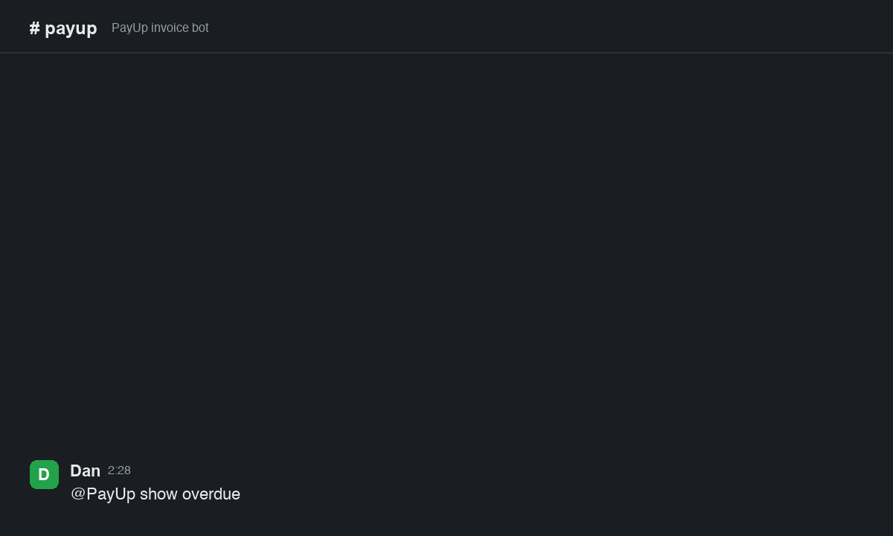
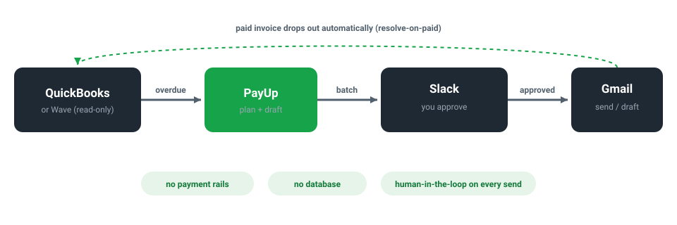

<div align="center">


# PayUp

**Chase overdue invoices from Slack. PayUp reads QuickBooks or Wave, drafts polite escalating reminders, and sends them via Gmail only after you approve.**

[](https://github.com/dancolta/payup/actions/workflows/ci.yml) [](LICENSE) [](#install)

**Install:** add the plugin in Claude Code and run `/payup-setup` · **Operate:** from Slack



</div>

> **What PayUp is not:** auto-dunning, a collections bot, a money-mover, or a mass-emailer. Nothing leaves your outbox until you approve it in Slack, the accounting side is read-only, and the firm "final" reminder is blocked from using legal or collections language.

PayUp does the part of invoice-chasing you hate (noticing who is overdue, writing the nudge) and leaves the part you want to keep (deciding what actually goes to a client). It is a human-in-the-loop alternative to Bill.com-style dunning, built for solo founders, freelancers, small agencies, and bookkeepers who already use QuickBooks or Wave plus Gmail plus Slack.

**Contents:** [How it works](#how-it-works) · [Slack commands](#slack-commands) · [Install](#install) · [Config](#config) · [How it compares](#how-it-compares) · [Guardrails](#guardrails-against-spamming-your-clients) · [FAQ](#faq)

## How it works

1. **Find.** Once a day (or on demand) PayUp queries QuickBooks or Wave for invoices that are overdue *and* still unpaid, and posts the batch to your `#payup` Slack channel. Nothing is sent.
2. **Approve.** You reply in plain language: `send 1 and 3`, `skip Delta`, or `draft all`. Tone escalates by age and history: gentle, then firm, then final.
3. **Send or draft.** `send` emails the reminder from your Gmail; `draft` drops it in your Gmail Drafts so you can edit and send it yourself. When the invoice is marked paid, it disappears from the next batch.

You can read the exact reminder copy before anything goes out. The shipped tone is restrained on purpose:

> *Gentle:* "Just a friendly heads up that invoice #1042 was due on the 13th and looks still open on our side. It may have slipped through."
>
> *Final:* "This is a final reminder that invoice #1042 remains unpaid. Please arrange payment, or reply with a firm date so we can close this out."

## Slack commands

| You type (`@PayUp ...`) | What happens |
|---|---|
| `show overdue` | posts the current overdue batch (sends nothing) |
| `send all` / `send 1 and 3` | emails those reminders after your approval |
| `draft all` / `draft 2` | saves those reminders as Gmail drafts to edit and send yourself |
| `skip Delta` | drops a row from this batch |
| `help` | lists the commands |

Anything ambiguous (a question, a negation, an unclear target) is treated as "do nothing" and PayUp asks you to clarify. It never sends on a guess.

## Install

PayUp is set up once inside Claude Code, then operated from Slack.

```bash
pip install -e '.[bot]'
```

Then add the repo as a local plugin marketplace in Claude Code and run **`/payup-setup`**. It walks you through the three connections below. You need a QuickBooks (or Wave) token, a Gmail OAuth consent, and a Slack app.

<details>
<summary>QuickBooks (default source)</summary>

Create a free developer account and a sandbox company at [developer.intuit.com](https://developer.intuit.com), mint an access token from the OAuth Playground (scope `com.intuit.quickbooks.accounting`), and put `QBO_ACCESS_TOKEN` + `QBO_REALM_ID` in `.env`. Keep `PAYUP_SOURCE=quickbooks`. For an always-on bot, also set `QBO_REFRESH_TOKEN` + `QBO_CLIENT_ID` + `QBO_CLIENT_SECRET` so PayUp renews the hourly token itself. Set `PAYUP_QBO_ENV=production` only when you point it at a real company.
</details>

<details>
<summary>Wave (US/Canada alternative)</summary>

Set `PAYUP_SOURCE=wave` and provide a full-access GraphQL `WAVE_API_TOKEN` + `WAVE_BUSINESS_ID`.
</details>

<details>
<summary>Gmail (the only outbound send)</summary>

Create an OAuth client (Desktop app) in Google Cloud Console, save the JSON to `config/oauth_client.json`, and run `python engine/scripts/gmail_oauth_setup.py` once. PayUp requests three Gmail scopes only: `send`, `readonly` (to dedupe against your Sent mail), and `compose` (to save drafts). No full-mailbox access.
</details>

<details>
<summary>Slack (Socket Mode, no public URL)</summary>

Create an app at [api.slack.com/apps](https://api.slack.com/apps), enable Socket Mode, add bot scopes `chat:write` + `app_mentions:read` + `channels:history`, install it, invite it to your channel, and put `SLACK_BOT_TOKEN` (xoxb) + `SLACK_APP_TOKEN` (xapp) in `.env`.
</details>

```bash
PAYUP_LIVE=0 python -m bot.app     # dry-run: drafts but never sends
```

Flip `PAYUP_LIVE=1` when the dry-run batch looks right. For always-on hosting, see the Fly.io guide further down.

## Config

Copy `.env.example` to `.env` and fill it in. The knobs you will actually touch:

| Variable | What it does | Default |
|---|---|---|
| `PAYUP_SOURCE` | `quickbooks` or `wave` | `quickbooks` |
| `PAYUP_LIVE` | `1` to send for real, `0` for dry-run | `0` |
| `PAYUP_MIN_GAP_DAYS` | never re-chase the same invoice within this many days | `7` |
| `PAYUP_TEMPLATES_CONFIG` | path to your custom reminder templates | `config/templates.yml` |

Reminder copy is yours to edit: change the gentle/firm/final templates in `config/templates.yml`. The guardrails still apply to your custom copy (see below).

## How it compares

|  | **PayUp** | Chaser / Upflow | Bill.com | QuickBooks reminders | Manual |
|---|:---:|:---:|:---:|:---:|:---:|
| You approve every send | ✓ | ✗ | ✗ | ✗ | ✓ |
| Never moves money (read-only) | ✓ | partial | ✗ | partial | ✓ |
| Cost | ~$0 (MIT) | $$/mo | $$/mo | bundled | free |
| Runs in your stack (Slack + Gmail) | ✓ | ✗ | ✗ | ✗ | ✓ |
| No new database | ✓ | ✗ | ✗ | ✗ | ✓ |
| Anti-spam gap + dedupe + resolve-on-paid | ✓ | partial | partial | ✗ | ✗ |
| Save drafts you edit before sending | ✓ | ✗ | ✗ | ✗ | ✓ |
| Collections language blocked by design | ✓ | ✗ | ✗ | n/a | n/a |

PayUp wins every control-and-ownership row and deliberately concedes the "fully automated, do it all for me" rows. That trade is the point.

## Guardrails against spamming your clients

These are enforced by tests, not just promised in docs:

- **Human-in-the-loop.** Nothing sends without an explicit `send` command. The daily timer only posts the batch.
- **Never moves money.** The engine only reads from the accounting source. There are no payment, transfer, or refund code paths.
- **No-nag gap.** An invoice chased in the last `min_gap_days` (default 7) is held out of the batch.
- **Dedupe from your Sent mail.** PayUp counts prior reminders by searching your Gmail Sent for the invoice number, so it cannot double-count or re-nag, even across restarts.
- **Resolve-on-paid.** A paid invoice drops out of the overdue query automatically. No manual cleanup.
- **Final tier never threatens.** Legal and collections language is blacklisted and blocked at render time, including in your custom templates.

## What it will never do

No payment rails. No moving money. No collections or legal escalation. No sending on a schedule you cannot see. The "final" tier is firm but never a threat. PayUp chases; it never pays, and it never sends without you.

## Architecture

State-light by design: there is no database. Your accounting tool and your Gmail Sent history are the source of truth, so PayUp has nothing to keep in sync.

<div align="center">

</div>

The invoice source is pluggable: every connector returns the same `Invoice` shape, so adding Xero or Stripe is one new connector file, not a new bot. See [CLAUDE.md](CLAUDE.md) for the contributor contract and the full invariant list.

## Deploy (always-on)

Socket Mode means no public URL and no inbound ports, so any always-on host works.

```bash
fly launch --no-deploy
fly secrets set QBO_ACCESS_TOKEN=... QBO_REALM_ID=... QBO_REFRESH_TOKEN=... \
                QBO_CLIENT_ID=... QBO_CLIENT_SECRET=... \
                SLACK_BOT_TOKEN=xoxb-... SLACK_APP_TOKEN=xapp-... PAYUP_LIVE=1
fly deploy
```

Railway, Render, a small VPS, or any machine that stays on works the same way.

## FAQ

### Does PayUp send invoice reminders automatically without approval?

PayUp never sends a reminder without explicit human approval in Slack. Every daily batch is posted for review, and nothing reaches a client until you reply with a command like `send all` or `send 1 and 3`. The scheduler only posts the batch; the send step always waits for a human.

### How is PayUp different from Bill.com?

PayUp is a human-in-the-loop alternative to Bill.com-style dunning. It drafts the chase and lets you approve each send, using tools you already pay for (QuickBooks, Gmail, Slack), while Bill.com auto-fires reminders and layers in payment processing. PayUp is read-only on accounting data and has no payment rails by design.

### What accounting platforms does PayUp support?

PayUp defaults to QuickBooks Online and also supports Wave for US and Canada businesses via `PAYUP_SOURCE=wave`. Both connectors expose the same invoice model, so switching sources is a config change, and adding a new provider like Xero is one connector file.

### How does PayUp avoid nagging clients repeatedly?

PayUp searches your Gmail Sent mail keyed on the invoice number to count prior reminders and enforce a configurable no-nag gap, and it automatically drops any invoice the accounting source marks as paid. Chasing resolves itself with no manual removal step.

### Is PayUp safe to use with real client data?

PayUp's guardrails are enforced by tests: no money-movement code paths exist, the final reminder tier is blocked from legal or collections language, and no secrets or PII are committed to the repo. It is MIT-licensed and the full source is public.

## Development

```bash
pip install -e '.[dev]'
ruff check engine bot
pytest          # fully mocked, runs in well under 2 seconds
```

Architecture and the non-negotiable invariants are documented in [CLAUDE.md](CLAUDE.md) and [AGENTS.md](AGENTS.md).

## License

MIT. See [LICENSE](LICENSE).

## Contributing

Issues and pull requests welcome. New behavior ships with tests, and the guardrail suite must stay green.
